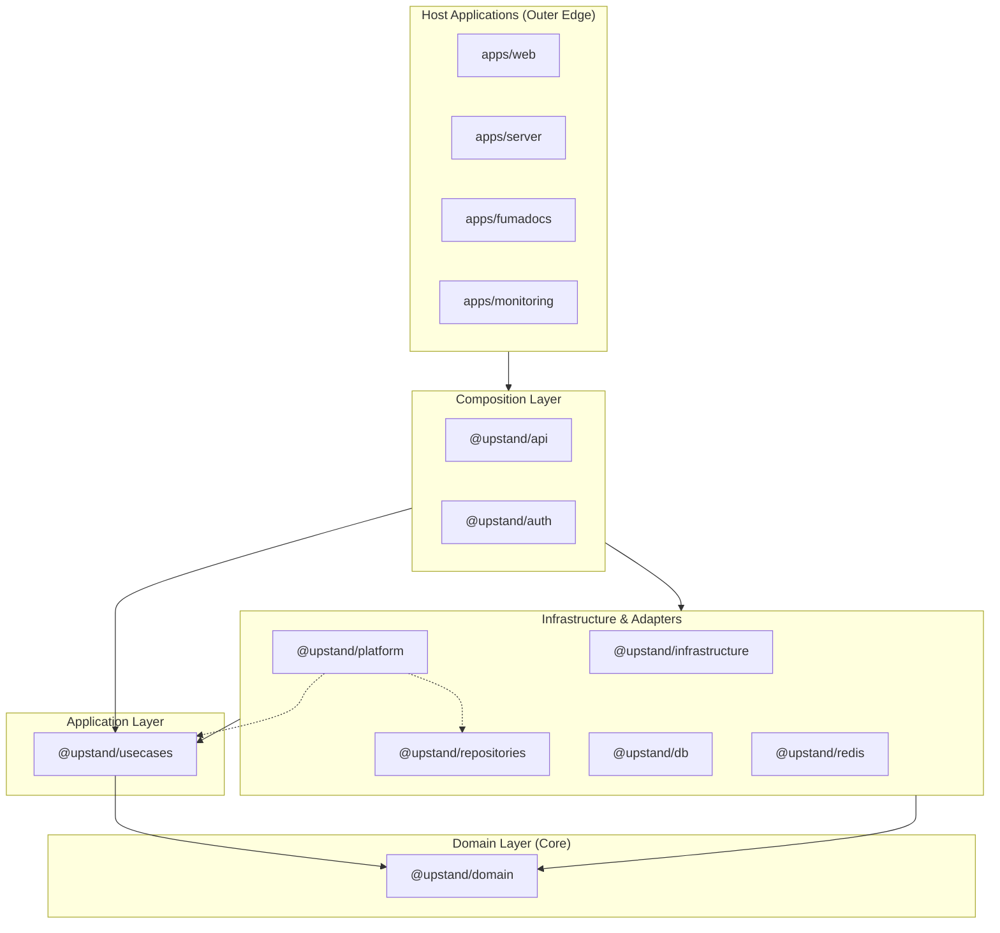

# Clean Architecture

Upstand uses a package-level version of Clean Architecture. Dependencies point
toward business policy, while concrete framework and runtime integrations are
assembled at the application edge.

## Package responsibilities

| Layer | Packages | Responsibility |
| --- | --- | --- |
| Domain | `@upstand/domain` | Entities, value objects, validation, errors, and repository ports. It has no workspace dependencies and no framework/runtime imports. |
| Application | `@upstand/usecases` | Use-case workflows, application services, and ports used by those workflows. It owns the application contracts and does not import API, auth, database, repositories, or UI packages. |
| Infrastructure | `@upstand/infrastructure`, `@upstand/repositories`, `@upstand/db` | External adapters: notification providers, persistence implementations, and Drizzle schema/database access. |
| Runtime infrastructure | `@upstand/redis` | Redis connection and runtime queue infrastructure. |
| Platform | `@upstand/platform` | Cross-cutting OS/crypto capabilities (secret encryption and SSH key operations). This remains a separate package because it is reused by application and persistence code without belonging to a business feature or a single external adapter. |
| Composition | `@upstand/api`, `@upstand/auth` | DI registrations, tRPC/Hono interface adapters, authentication configuration, and composition of application contracts with infrastructure implementations. |
| Interface | `@upstand/ui` | Shared React UI primitives. |
| Hosts | `apps/server`, `apps/web`, `apps/fumadocs` | Process startup, delivery, and deployment-specific wiring. |

`@upstand/infrastructure` is intentionally not a mega-package. Database,
repository, Redis, and platform concerns have separate packages because each
has one cohesive purpose; they are all classified as outer infrastructure in
the boundary policy.

## Architecture & Dependency Flow

## Rules enforced in CI

- `packages/config/src/architecture.test.ts` verifies package classification,
  dependency direction, import declarations, private-path isolation, cycles,
  domain independence, typed DI-token ownership, and the notification port /
  adapter split.
- `turbo boundaries` verifies workspace package isolation and the tag policy
  in `turbo.json`.
- DI tokens are declared only in `packages/usecases/src/tokens.ts` or
  `packages/repositories/src/tokens.ts`, and consumers import those canonical
  modules instead of reconstructing token names.

When a new external integration is needed, add its contract to the domain or
application layer first, implement it in an outer package, and register it in
the composition root.
