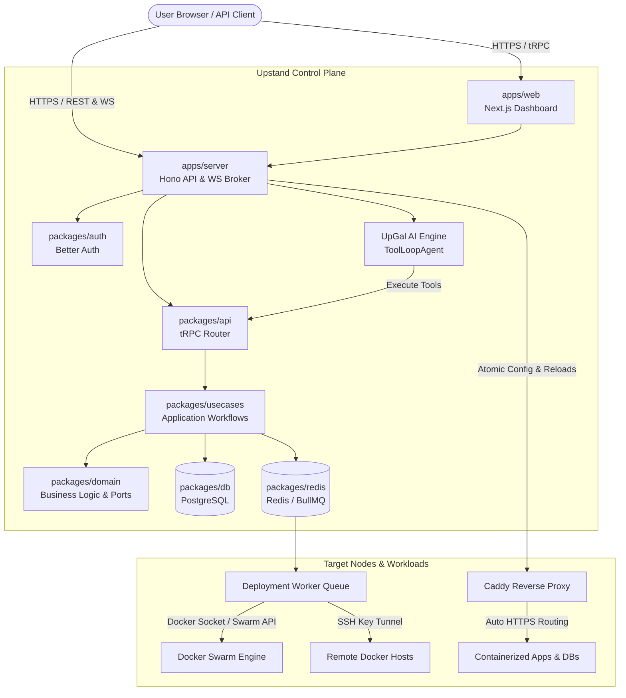

# Upstand

Upstand is a modern, container-first self-hostable control plane (PaaS) designed to orchestrate Docker Swarm nodes, deploy applications and databases, configure dynamic Caddy routing, and run remote server operations from a unified web interface. 

It is built as a Bun/TypeScript monorepo leveraging Next.js, Hono, tRPC, Drizzle, PostgreSQL, Redis, Docker Swarm, and Better Auth.

---

## What Upstand Provides

### 📦 Application & Database Deployments
- **Flexible Builders**: Deploy using **Dockerfile** (with BuildKit secrets support), **Railpack**, **Nixpacks**, **Heroku Buildpacks**, **Paketo Buildpacks**, or **Static** folder serving (with SPA fallback).
- **Database Engines**: Natively provisions **PostgreSQL**, **MySQL**, **MariaDB**, **MongoDB**, **Redis**, and **libSQL (sqld)** (with dynamic HTTP/gRPC/admin port bindings and auto-derived auth tokens). Exposes custom diagnostic interfaces and safe container restarts or volume rebuilds.
- **Docker Compose & Stacks**: Write Compose files and run them using standard Compose or Swarm Stacks. Upstand includes a Compose-to-Stack syntax translator and volume/network name collision-safe randomization.
- **Durable Build Queues**: Deployment tasks run in independent server-node queues (`deployments-queue-<nodeId>`) with concurrency adjustments and build locking.

### 🌐 Routing, Certificates & Web Server
- **Atomic Caddy Reloads**: Dynamic Caddyfile compilation. Before reloads, configurations are dry-run validated inside the container. If it fails, the prior known-good config is preserved to avoid routing outages.
- **Automatic HTTPS**: Auto-managed TLS certificates through Let's Encrypt (production) or Caddy's Internal CA (private networks).
- **Advanced Routing Middleware**: Configure 301/302/307/308 redirects, custom HSTS/security headers, forward authentication proxy gates (with header copies), and basic authentication (supporting bcrypt hashes).

### 🖥️ Remote Server & Node Operations
- **Remote Server SSH Provisioning**: Register standalone Docker engines. Upstand connects over SSH (key-based), installs Docker Engine, initializes Swarm, provisions Caddy, and targets builds without joining the core control-plane Swarm.
- **Swarm Clustering**: Reveal and rotate manager/worker join tokens, drain nodes for maintenance, and remove cluster nodes safely without losing Raft quorum.
- **Owner SSH Terminal**: Interactive, WebSocket-brokered web terminal restricted exclusively to the Global Owner.
- **Log Reviewer**: Buffers log streams, filters by log levels (`Info`/`Error`/`Warning`/`Success`), allows search highlighting, and supports downloads.

### 💾 Backup, Recovery & Transfers
- **S3 Backups**: Back up databases and volume directories directly to S3-compatible endpoints using integrated **rclone** processes.
- **Control-Plane Backups**: Backup the PostgreSQL system database and Caddy volume configurations in a single archive. Restore operations require verified 2FA, administrative permissions, and validation strings.
- **Secure File Transfers**: Upload `.tar` archives (up to 50 MB) securely into named Docker volumes or active containers.

### 🔒 Enterprise Security & SSO
- **Owner-First Bootstrap**: The first account created on a new database is assigned Global Owner. Additional registrations are blocked.
- **Corporate Single Sign-On (SSO)**: Add OIDC and SAML 2.0 logins. Domain enforcement is secured using DNS TXT ownership challenges (`_upstand-sso.<domain>`).
- **SCIM 2.0 User Provisioning**: Standardized `/api/scim/v2.0/<organizationId>` endpoints for automated directory user syncs.
- **TOTP 2FA & API Keys**: Enforce multi-factor authentication on critical actions (terminal, database rebuilds, backups) and issue scoped API keys (`upk_...`) for external integrations.

### 🤖 UpGal AI Operations Assistant
- **ToolLoopAgent**: Bounded to 12-step execution loops. Allows natural language infrastructure inspection and modification.
- **Mutation Approvals**: Operations such as resource deployments, creations, and deletions require explicit user confirmation via dashboard card prompts.
- **Model Context Protocol (MCP)**: Exposes a JSON-RPC endpoint at `/api/mcp` for external agents, supporting granular API key permissions.

---

## System Architecture



---

## Repository Map

```text
apps/web/               Next.js dashboard console & UI components
apps/server/            Hono API, tRPC routes, terminal broker, and worker queues
apps/monitoring/        System metrics collector & daemon watcher
apps/fumadocs/          Documentation site (Fumadocs)
packages/domain/        Core business rules, entities, and repository ports
packages/usecases/      Use case workflows and operational logic
packages/infrastructure/ External provider adapters (databases, notifications)
packages/db/            Drizzle PostgreSQL schema and migrations
packages/repositories/  Drizzle repository implementations
packages/redis/         Redis connection and BullMQ queue orchestration
packages/platform/      Crypto modules and SSH operations
packages/auth/          Better Auth configuration and authentication adapters
packages/api/           tRPC router definitions and Hono bindings
packages/ui/            Shared design primitives and design tokens
packages/env/           Zod-validated environment configurations
packages/config/        Shared TypeScript, Biome, and Architecture boundary rules
install.sh              Production installer script
docker-compose.local.yml Local development database/queue services
docker-compose.prod.yml  Production Swarm stack configuration
```

---

## Local Development

### Prerequisites
- **Bun 1.3.14**
- **Docker Engine & Compose v2**

### Setup
1. Clone the repository:
   ```bash
   git clone https://github.com/mhbdev/upstand.git
   cd upstand
   ```
2. Run the idempotent local setup:
   ```bash
   bun setup
   ```
   This creates ignored local environment files for the API and web app, installs dependencies, starts PostgreSQL and Redis, waits for readiness, and applies the checked-in migrations.
3. Launch the development workspace:
   ```bash
   bun dev
   ```
   Open `http://localhost:3001` for the web console, `http://localhost:3000/api/docs/` for the API Swagger UI, and `http://localhost:4000` for Fumadocs. Run `bun setup` again after pulling dependency or schema changes.

For database schema changes, update the TypeScript schema and run `bun run db:generate`; Drizzle Kit generates the migration files. Never create migration files manually.

---

## Production Installation & Deployments

Upstand can be installed as a **Self-Hosted** instance or run as a multi-tenant **Cloud Service** (SaaS) depending on the configuration flags.

### 1. Self-Hosted Mode (Default)
In self-hosted mode, you can deploy applications, databases, and Docker Compose configurations directly onto the local Docker Swarm manager node running the Upstand dashboard.

To install Self-Hosted Upstand on a fresh Linux Swarm manager node:

```bash
export BETTER_AUTH_URL=https://api.example.com
export CORS_ORIGIN=https://app.example.com
export NEXT_PUBLIC_SERVER_URL=https://api.example.com

# Pin image digests
export UPSTAND_SERVER_IMAGE=ghcr.io/mhbdev/upstand-server@sha256:<digest>
export UPSTAND_MONITORING_IMAGE=ghcr.io/mhbdev/upstand-monitoring@sha256:<digest>
export UPSTAND_WEB_IMAGE=ghcr.io/mhbdev/upstand-web@sha256:<digest>
export UPSTAND_DOCS_IMAGE=ghcr.io/mhbdev/upstand-fumadocs@sha256:<digest>

curl -fsSL https://raw.githubusercontent.com/mhbdev/upstand/master/install.sh | sudo bash
```

### 2. Cloud Mode (Multi-Tenant SaaS)
In cloud mode, local server target deployments are blocked for security and resource isolation. Users are forced to add and select their own remote servers (connected via SSH) to run applications, databases, and registry configurations.

To deploy Upstand in cloud mode, enable the following flags in your environment configuration before starting the control-plane containers:

```bash
export BETTER_AUTH_URL=https://api.example.com
export CORS_ORIGIN=https://app.example.com
export NEXT_PUBLIC_SERVER_URL=https://api.example.com

# Pin all release images. The cloud web image contains the cloud client build.
export UPSTAND_SERVER_IMAGE=ghcr.io/mhbdev/upstand-server@sha256:<digest>
export UPSTAND_WEB_CLOUD_IMAGE=ghcr.io/mhbdev/upstand-web-cloud@sha256:<digest>
export UPSTAND_MONITORING_IMAGE=ghcr.io/mhbdev/upstand-monitoring@sha256:<digest>
export UPSTAND_DOCS_IMAGE=ghcr.io/mhbdev/upstand-fumadocs@sha256:<digest>

curl -fsSL https://raw.githubusercontent.com/mhbdev/upstand/master/install.sh | sudo bash - --cloud
```

The `--cloud` flag sets the server and client cloud modes and selects `UPSTAND_WEB_CLOUD_IMAGE`. The installer validates all configured API, dashboard, and documentation origins from the deployment host before reporting success.

For detailed guides, refer to the local documentation site (`apps/fumadocs`) or navigate to `/docs/getting-started` once deployed.

### Contributors 🤝

<a href="https://github.com/mhbdev/upstand/graphs/contributors">
  
</a>
