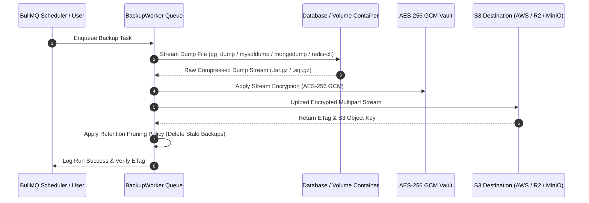
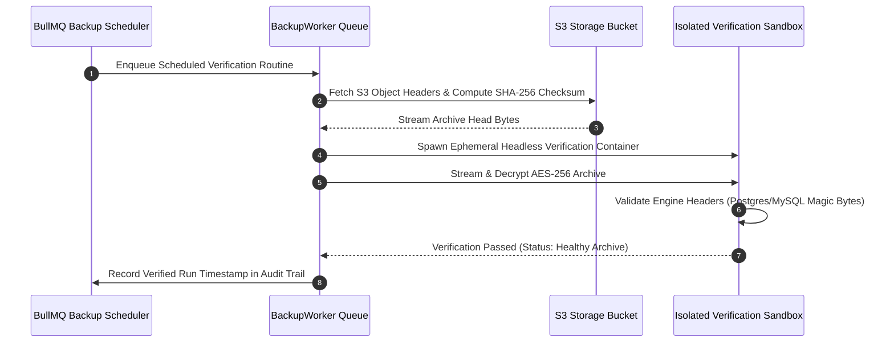

Upstand stores automated database and volume backups in organization-owned S3-compatible destinations (AWS S3, Cloudflare R2, DigitalOcean Spaces, Wasabi, MinIO). Configure destinations under **Integrations → S3 Storage**, test the connection, and then assign them to resource schedules or control-plane backup policies.

---

## Backup & Restoration Pipeline

---

## Storage Destinations

The S3 destination form accepts a name, provider, access key, secret access key, bucket, region, optional endpoint, and optional additional flags. The UI is designed for AWS S3 and compatible services such as Cloudflare R2, Wasabi, and DigitalOcean Spaces. Always test the connection after changing credentials or endpoints.

---

## Resource Backup Schedules

From a resource's **Backups** tab, create a schedule with its destination and retention settings. Upstand can list eligible volumes and Compose services, run a backup immediately, list historical runs, verify a run, and restore a run. The scheduler and worker record the run status and logs so a failed backup is visible in Observation.

Backups are also a supported Cron Job target. A Cron Job can trigger an existing backup schedule; it does not replace the backup schedule's storage and retention configuration.

---

## Automated Backup Integrity Verification Routine

To guarantee data recovery readiness, Upstand provides automated headless backup verification:

- **Checksum & ETag Audit**: Queries S3 object headers to confirm remote file size and ETag hash integrity.
- **Headless Sandbox Testing**: Spawns an isolated ephemeral container to decrypt stream headers and verify database engine signature magic bytes (`PGDMP` for PostgreSQL, SQL dump headers for MySQL, RDB headers for Redis).
- **Failure Notification**: If an archive fails validation or encounters corruption, the `BackupWorker` immediately marks the run as corrupted and dispatches a high-priority alert via configured notification channels.
