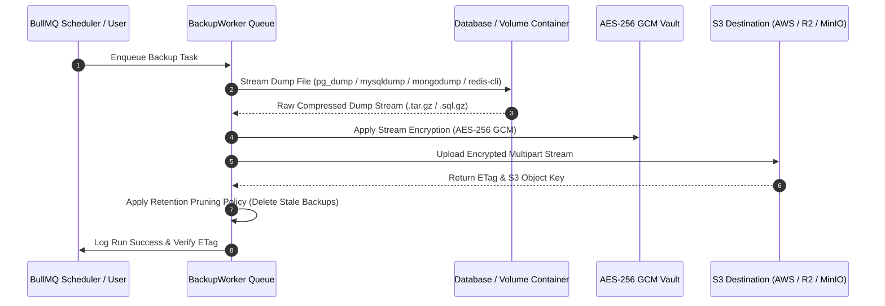
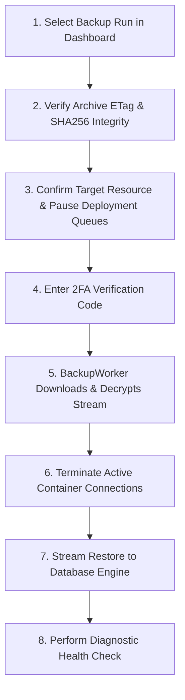

Upstand stores automated database and volume backups in organization-owned S3-compatible destinations (AWS S3, Cloudflare R2, DigitalOcean Spaces, Wasabi, MinIO). Configure destinations under **Integrations → S3 Storage**, test the connection, and then assign them to resource schedules or control-plane backup policies.

---

## Backup & Restoration Pipeline

---

## Storage Destinations

The S3 destination form accepts a name, provider, access key, secret access key, bucket, region, optional endpoint, and optional additional flags. The UI is designed for AWS S3 and compatible services such as Cloudflare R2, Wasabi, and DigitalOcean Spaces. Always test the connection after changing credentials or endpoints.

---

## Resource Backup Schedules

From a resource's **Backups** tab, create a schedule with its destination and retention settings. Upstand can list eligible volumes and Compose services, run a backup immediately, list historical runs, verify a run, and restore a run. The scheduler and worker record the run status and logs so a failed backup is visible in Observation.

Backups are also a supported Cron Job target. A Cron Job can trigger an existing backup schedule; it does not replace the backup schedule's storage and retention configuration.

---

## Step-by-Step Restoration Workflow

Restoring a database or container volume is a critical operation. Follow this step-by-step restoration protocol:

1. **Identify Backup Archive**: Go to your resource's **Backups** tab and click **Verify** on the desired backup run to validate archive availability and checksums.
2. **Pause Concurrent Tasks**: Ensure no deployments, migrations, or active cron tasks are currently modifying the database.
3. **Trigger Restoration**: Click **Restore Run**. Confirm the destructive alert modal by entering your 2FA verification code.
4. **Inspect Recovery**: Review the streaming restoration log in the dashboard to confirm database tables and records are fully restored and healthy.
