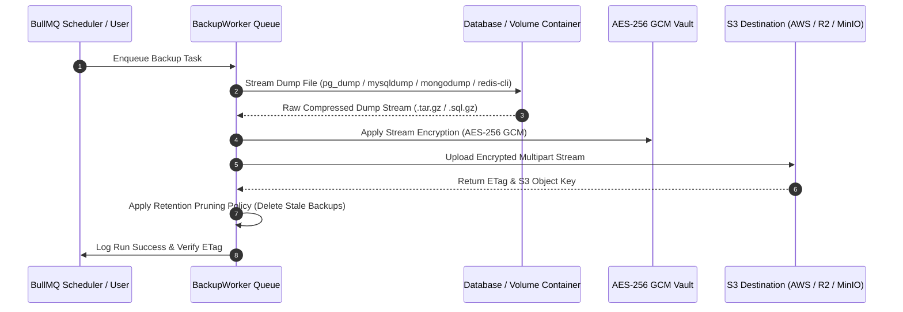
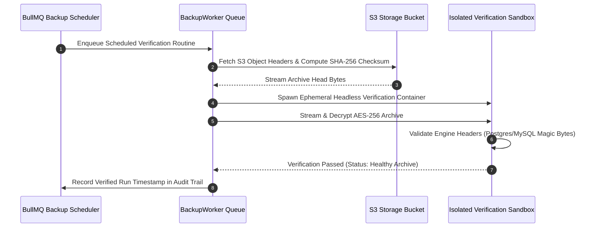

Upstand stores automated database and volume backups in organization-owned S3-compatible destinations (AWS S3, Cloudflare R2, DigitalOcean Spaces, Wasabi, MinIO). Configure destinations under **Integrations → S3 Storage**, test the connection, and then assign them to resource schedules or control-plane backup policies.

---

## Backup & Restoration Pipeline

```mermaid
sequenceDiagram
    autonumber
    participant Cron as BullMQ Scheduler / User
    participant Worker as BackupWorker Queue
    participant Engine as Database / Volume Container
    participant Encrypt as AES-256 GCM Vault
    participant S3 as S3 Destination (AWS / R2 / MinIO)

    Cron->>Worker: Enqueue Backup Task
    Worker->>Engine: Stream Dump File (pg_dump / mysqldump / mongodump / redis-cli)
    Engine-->>Worker: Raw Compressed Dump Stream (.tar.gz / .sql.gz)
    Worker->>Encrypt: Apply Stream Encryption (AES-256 GCM)
    Worker->>S3: Upload Encrypted Multipart Stream
    S3-->>Worker: Return ETag & S3 Object Key
    Worker->>Worker: Apply Retention Pruning Policy (Delete Stale Backups)
    Worker->>Cron: Log Run Success & Verify ETag
```

---

## Storage Destinations & S3 Encryption

The S3 destination form accepts a name, provider, access key, secret access key, bucket, region, optional endpoint, custom CA certificate, and optional additional flags. The UI supports AWS S3 and compatible services such as Cloudflare R2, Wasabi, DigitalOcean Spaces, and self-hosted MinIO. Always test the connection after changing credentials or endpoints.

### Custom CA Certificates for Private S3 Endpoints

When connecting to private or self-hosted S3 storage (such as MinIO or internal S3 clusters using custom or self-signed TLS certificates), you can select an uploaded Custom CA Certificate (from **Infrastructure → Certificates**). Upstand automatically injects `--ca-cert=<path>` into the underlying rclone backup and restore streams.

### S3 Server-Side Encryption (SSE) Support

Upstand supports S3 Server-Side Encryption for all scheduled and **on-demand backups and restores**:
- **SSE-S3 (AES256)**: Amazon S3-managed keys (`--s3-server-side-encryption=AES256`).
- **SSE-KMS (AWS KMS)**: AWS Key Management Service keys (`--s3-server-side-encryption=aws:kms` and `--s3-sse-kms-key-id=<kms-key-arn>`).
- **SSE-C (Customer Key)**: Customer-provided encryption keys (`--s3-sse-customer-algorithm=AES256` and `--s3-sse-customer-key=<key>`).

All encryption headers are applied transparently by rclone on both backup push and restore pull streams. Safe S3 encryption parameters are also supported during S3 connection testing.

---

## Resource Backup Schedules

From a resource's **Backups** tab, create a schedule with its destination and retention settings. Upstand can list eligible volumes and Compose services, run a backup immediately, list historical runs, verify a run, and restore a run. The scheduler and worker record the run status and logs so a failed backup is visible in Observation.

Backups are also a supported Cron Job target. A Cron Job can trigger an existing backup schedule; it does not replace the backup schedule's storage and retention configuration.

---

## Automated Backup Integrity Verification Routine

To guarantee data recovery readiness, Upstand provides automated headless backup verification:

```mermaid
sequenceDiagram
    autonumber
    participant Scheduler as BullMQ Backup Scheduler
    participant Worker as BackupWorker Queue
    participant S3 as S3 Storage Bucket
    participant Container as Isolated Verification Sandbox

    Scheduler->>Worker: Enqueue Scheduled Verification Routine
    Worker->>S3: Fetch S3 Object Headers & Compute SHA-256 Checksum
    S3-->>Worker: Stream Archive Head Bytes
    Worker->>Container: Spawn Ephemeral Headless Verification Container
    Worker->>Container: Stream & Decrypt AES-256 Archive
    Container->>Container: Validate Engine Headers (Postgres/MySQL Magic Bytes)
    Container-->>Worker: Verification Passed (Status: Healthy Archive)
    Worker->>Scheduler: Record Verified Run Timestamp in Audit Trail
```

- **Checksum & ETag Audit**: Queries S3 object headers to confirm remote file size and ETag hash integrity.
- **Headless Sandbox Testing**: Spawns an isolated ephemeral container to decrypt stream headers and verify database engine signature magic bytes (`PGDMP` for PostgreSQL, SQL dump headers for MySQL, RDB headers for Redis).
- **Failure Notification**: If an archive fails validation or encounters corruption, the `BackupWorker` immediately marks the run as corrupted and dispatches a high-priority alert via configured notification channels.
