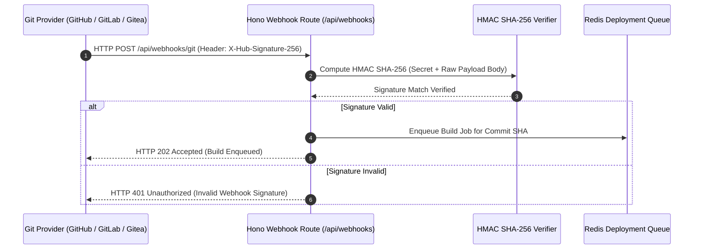

Upstand integrates with your organization's existing DevOps tooling and enterprise security stack. Navigate to **Integrations** in the sidebar to configure external services.

---

## 1. Git Providers

Git providers allow Upstand to browse repositories, list branches, auto-detect build configurations, and receive webhook notifications for automated deployments on push or tag.

### Supported Providers
- **GitHub**: Native App & Personal Access Token support.
- **GitLab**: Support for GitLab.com and self-hosted GitLab instances.
- **Bitbucket**: Bitbucket Cloud & Data Center.
- **Gitea**: Open-source self-hosted Gitea instances.

### Setup & Configuration
1. Navigate to **Integrations → Git Providers** (`/git-providers`).
2. Click **Add Git Provider** and select your platform:
   - **GitHub / Bitbucket**: Provide provider client credentials or Personal Access Tokens.
   - **GitLab / Gitea**: Provide the instance HTTPS URL (e.g. `https://gitlab.example.com`), OAuth `Client ID`, `Client Secret`, and optional `Webhook Secret`.
3. **Allowed Host Policy**: Self-hosted GitLab or Gitea URLs must use HTTPS with valid hostnames. Operators can enforce allowed domain boundaries via `UPSTAND_GIT_PROVIDER_ALLOWED_HOSTS`.
4. **Webhook Setup**: Enable push/tag auto-deployments on any Application resource by copying the generated Webhook URL and Webhook Secret into your Git repository settings.

### Git Webhook HMAC Verification Sequence

---

## 2. S3-Compatible Storage Destinations

S3 destinations are used for automated and manual database and volume backups.

### Supported Providers
AWS S3, Cloudflare R2, MinIO, Wasabi, DigitalOcean Spaces, Backblaze B2, Google Cloud Storage (S3 API), Ceph, Linode Object Storage, and custom S3 gateways.

### Setup & Configuration
1. Navigate to **Integrations → S3 Storage** (`/s3-destinations`).
2. Click **Add S3 Destination** and fill in connection details:
   - **Name**: A descriptive label (e.g. `AWS Production Backups`).
   - **Provider**: Select your vendor preset.
   - **Access Key ID & Secret Access Key**: Credentials scoped strictly to the target bucket.
   - **Bucket Name**: The target storage bucket.
   - **Region**: Storage region (e.g. `us-east-1`, `auto` for Cloudflare R2).
   - **Endpoint URL**: Required for non-AWS providers (e.g. `https://<accountid>.r2.cloudflarestorage.com` or `https://minio.company.com:9000`).
3. **Test Connection**: Click **Test Connection** before saving. Upstand verifies read/write access against the bucket.
4. **Backup Assignment**: Assign configured S3 destinations in resource backup schedules.

---

## 3. External Secret Providers

Connect external enterprise secret engines (**HashiCorp Vault**, **AWS Secrets Manager**, **1Password Connect**) to inject, sync, and rotate secrets dynamically across your environments and workloads.

### Setup & Provider Specs
Navigate to **Integrations → Secret Providers** (`/secret-providers`):

- **HashiCorp Vault**: Requires `Address` (e.g. `https://vault.example.com:8200`), `KV Secret Path` (e.g. `secret/data/myapp`), and `Vault Token`.
- **AWS Secrets Manager**: Requires `Region`, `Access Key ID`, `Secret Access Key`, and `Secret Path/ID`. Requests are signed with **AWS SigV4**.
- **1Password Connect**: Requires `Connect Host`, `Connect Token`, `Vault ID`, and `Item ID`.

### Environment & Resource Workflows
- **Syncing**: In any Environment or Resource **Environment Variables** tab, click **Sync External Provider**. Choose **Merge** or **Overwrite** mode to import secrets and trigger workload re-deployments.
- **Rotation Schedules**: Create recurring rotation intervals with target key selection and value length. Concurrency is guarded via atomic claim locks (`rotationClaimedUntil`).
- **Version History**: Review logged snapshots (`v1`, `v2`, etc.) and execute one-click rollbacks with automatic workload re-deployments.

---

## 4. SCIM 2.0 Directory Provisioning

System for Cross-domain Identity Management (SCIM 2.0) automates user lifecycle management from central identity providers (Okta, Microsoft Entra ID / Azure AD, PingIdentity, JumpCloud).

### Endpoint & Setup
1. Navigate to **Integrations → SCIM** (`/settings/scim`).
2. Click **Generate Provisioning Token**. Upstand displays a bearer token (`upscim_...`). Save this token securely; only its SHA-256 hash is persisted.
3. Configure your Identity Provider (IdP):
   - **SCIM Base URL**: `/api/scim/v2.0/<organizationId>`
   - **Authentication**: Bearer Token (`upscim_...`)
4. **Supported Operations**:
   - `GET /Users`, `POST /Users`: Discover and auto-provision organization users.
   - `PUT /Users/{id}`, `PATCH /Users/{id}`: Sync name, email, and group status.
   - `DELETE /Users/{id}` / Deactivation: Instantly revokes all active organization sessions while preserving the global user identity.

---

## 5. Single Sign-On (SSO: OIDC & SAML 2.0)

Enforce enterprise authentication via OpenID Connect (OIDC) or SAML 2.0 identity providers (Okta, Azure AD / Entra ID, Google Workspace, Keycloak, PingFederate).

### Setup & Configuration
1. Navigate to **Integrations → Single Sign-On** (`/settings/sso`).
2. Click **Configure SSO Provider**:
   - **OIDC Setup**: Enter `Issuer URL`, `Client ID`, and `Client Secret`.
   - **SAML 2.0 Setup**: Enter `SSO URL`, `Entity ID`, and paste the IdP X.509 Certificate (PEM format) or upload Metadata XML.
3. **Domain Verification**:
   - Add your company domain (e.g. `acme.com`).
   - Add the generated DNS TXT record `_upstand-sso.acme.com` to verify domain ownership.
   - Click **Verify DNS**.
4. **Strict SSO Enforcement**: When enabled, password-based logins are blocked for accounts belonging to the verified domain, seamlessly redirecting users to your IdP.

---

## 6. Docker Registries

Store credentials for pulling private container images or publishing built images to registries (Docker Hub, GitHub Container Registry, Amazon ECR, GitLab Container Registry, Quay.io, self-hosted Docker Registry).

- Navigate to **Infrastructure → Docker Registry** (`/docker-registry`).
- Provide Registry URL, Username, and Password/Token.
- Assign registries to Application or Compose build and rollback workflows.

---

## 7. SSH Keys

Manage reusable Ed25519 or RSA 2048-bit SSH keys for remote server orchestration and private Git repository cloning.

- Navigate to **Infrastructure → SSH Keys** (`/ssh-keys`).
- Generate a new keypair or import existing private/public keys.
- Install public keys onto remote servers using the server wizard. Private keys are encrypted at rest with the cluster master key.

---

## 8. TLS Certificates

Manage custom TLS certificates and private keys for custom domain routing.

- Navigate to **Infrastructure → Certificates** (`/certificates`).
- Paste PEM-encoded certificate chains and private keys.
- Upstand validates certificate expiration, SAN domains, and key matching before attaching certificates to Web Server reverse proxy routes.
