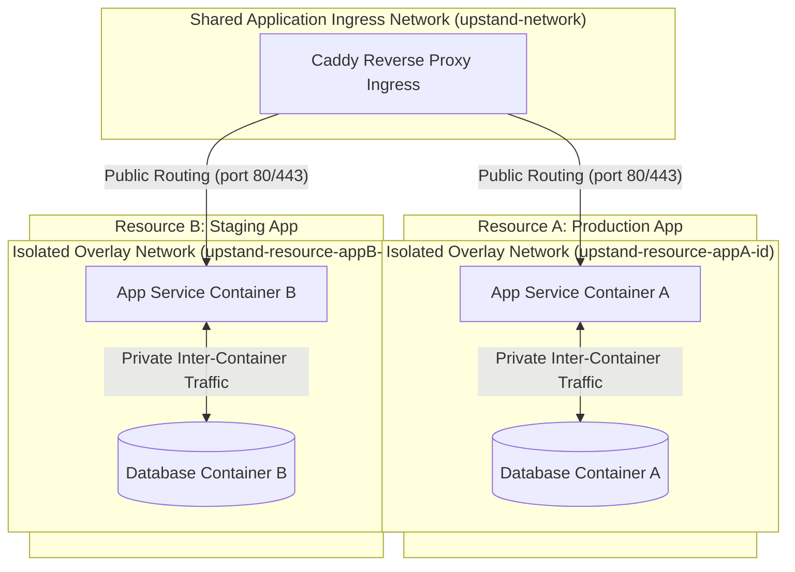
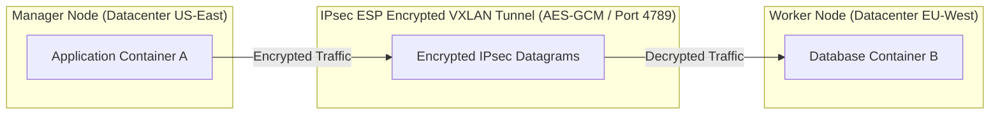

Upstand structures containerized workloads into an organization-scoped hierarchy: **Organization → Project → Environment → Resource**.

---

## Network Isolation & Overlay Architecture

Upstand enforces network isolation using Docker Swarm attachable overlay networks (`Driver: "overlay"`, `Scope: "swarm"`, `Attachable: true`):

### Network Security Dual-Overlay Model
1. **Shared Ingress Overlay (`upstand-network`)**: Connects the Caddy reverse proxy container to application services for public HTTP/HTTPS traffic forwarding.
2. **Per-Resource Isolated Overlay (`upstand-resource-<resource-id>`)**: Created automatically for each resource/stack. Private container-to-container communication (such as an application container talking to its database container) stays strictly isolated inside `upstand-resource-<id>`, preventing cross-tenant or cross-resource container snooping.

---

### IPsec Encrypted Overlay Networks (`--opt encrypted`)

For multi-node Swarm clusters spanning public subnets or inter-datacenter links, Upstand supports IPsec ESP encrypted overlay networks:

- **Encryption Protocol**: Enforces IPsec Encapsulating Security Payload (ESP) encryption on all VXLAN traffic crossing host nodes using AES-GCM encryption.
- **Enabling IPsec Encryption**: Pass `--opt encrypted` when defining overlay networks or toggle **Enable IPsec Encryption** under Resource Advanced Networking settings.
- **Performance Impact**: Hardware AES-NI CPU instructions minimize overhead to less than 2-3% latency impact.

---

## 1. Create the Hierarchy

Open **Workloads → Projects**. Create a project, open it, and create one or more environments. An environment can be default or protected, can have shared variables, and can optionally inherit variables from a parent environment.

Environment variables are stored as an encrypted serialized document. Resource variables are layered with environment variables at runtime; use environment scope for values shared by several resources and resource scope for values that must stay local to one workload.

---

## 2. Applications

An application is a Git-backed or image-backed workload. Its configuration includes:

- **Source/Provider**: Repository selection (GitHub, GitLab, Bitbucket, Gitea, or generic Git URLs).
- **Triggers**: Push or tag deployment triggers, tag patterns, and watched paths.
- **Build Systems**: Dockerfile (BuildKit secret mounts), Nixpacks, Railpacks, Cloud Native Buildpacks, or Static SPA.
- **Registries**: Configured build and rollback container registries.
- **Environment Variables**: Secret vault encryption and `${{env.VAR}}` dynamic resolution.
- **Placement**: Target deployment server and optional dedicated build server.
- **Runtime Configuration**: Command, arguments, published ports, persistent volumes, replicas, placement constraints, restart policies, and health checks.

Use the resource **General** and **Advanced** tabs to review the effective configuration before deploying.

---

## 3. Compose and Stack Resources

Create a Docker Compose resource and choose one of the supported modes:

- **Compose Mode**: Uses standard `docker compose` semantics for single-host execution.
- **Stack Mode**: Deploys services using `docker stack deploy` on Docker Swarm.

Upstand translates Compose definitions for Swarm compatibility:
- Strips fixed `container_name` attributes.
- Maps `restart: always` to Swarm `deploy.restart_policy` specifications.
- **Name Randomization**: Applies collision-safe randomized hashes to service, network, volume, config, and secret names when deploying multiple instances of the same Compose template.

---

## 4. Databases

Upstand natively manages PostgreSQL, MySQL, MariaDB, MongoDB, Redis, and libSQL. 

- **Volume Persistence**: Managed volumes (`upstand-db-data-<id>`) are bound to standard database data paths on disk.
- **Engine Diagnostics**: Runs credential-aware health checks (`pg_isready -U <user> -d <db>`, `redis-cli -a <pass> ping`, `mongosh -u <user> -p <pass>`, `mysqladmin ping -p<pass>`) rather than unauthenticated generic checks.
- **Rebuilding**: Rebuilding a database explicitly deletes its managed volume and recreates a fresh engine container. *Always verify backups before rebuilding.*

---

## 5. Resource Control Tabs

For Applications and Compose resources, the detail page contains **General**, **Environment**, **Advanced**, **Domains**, **Deployments**, **Containers**, **Backups**, **Logs**, **Console**, **Monitoring**, **Tags**, and **Cron Jobs**. Database resources omit Advanced, Domains, and Cron Jobs.

The interactive **Console** requires step-up 2FA verification and user authorization to open `docker exec` terminal sessions.
