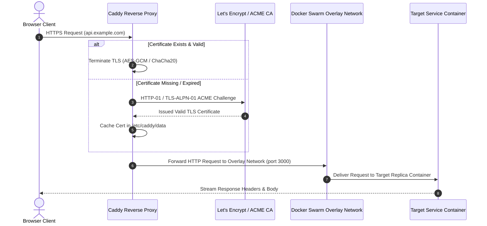
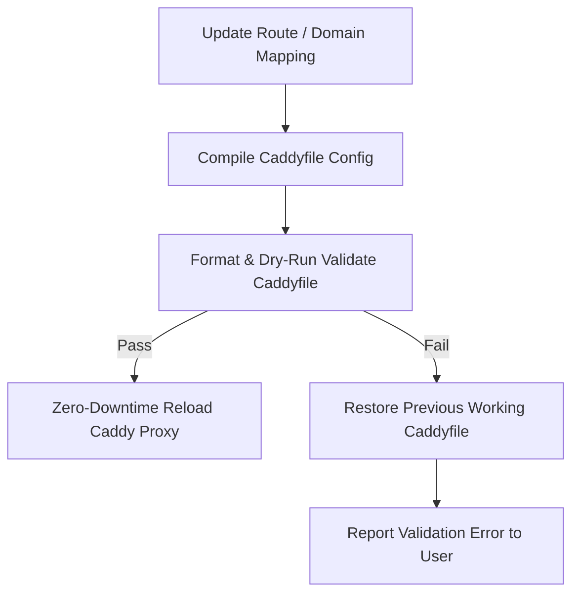

Upstand orchestrates a central **Caddy Web Server** container to serve as the entry point for all public domain routing.

---

## 1. Domain Configuration

You can assign public domains to Applications, Compose services, and Databases in the resource's **Domains** tab.

A domain mapping consists of:
- **Hostname**: A fully-qualified public domain name (e.g. `api.example.com`). Upstand normalizes hostnames and rejects raw IP addresses, wildcards, and ports.
- **Paths**: A public path prefix (e.g., `/v1`) and an optional internal rewrite destination.
- **Port Mapping**: The target container port (e.g., `3000`).
- **Snippets**: Reusable Caddy configuration snippets imported by name.
- **Path Stripping**: If enabled, strips the prefix before forwarding traffic.

---

## 2. HTTPS & SSL Strategies

Upstand configures and reloads certificates dynamically. You can choose between two certificate strategies:

### Let's Encrypt (Production Default)
- Automatically completes ACME HTTP-01 or TLS-ALPN-01 challenges.
- Caddy caches certificates, private keys, and renewal statuses in a persistent volume.
- **Prerequisites**: DNS must resolve to the server IP and TCP ports **80** and **443** must be open publicly.

### Caddy Internal CA
- Generates locally-trusted certificates using Caddy's built-in Certificate Authority.
- Best for staging, local development, or isolated private network deployments.
- *Note: Browsers and clients must manually import the Caddy root certificate to avoid untrusted warning screens.*

---

## 3. Security Headers & Redirects

Configure advanced proxy settings directly inside the domain mapping card:

- **Redirects**: Terminate incoming requests and issue HTTP `301/302/307/308` redirects.
- **Security Headers**: Inject standard headers to secure client connections:
  - `Strict-Transport-Security` (HSTS)
  - `X-Content-Type-Options: nosniff`
  - `X-Frame-Options: DENY`
  - `Referrer-Policy: no-referrer-when-downgrade`

---

## 4. Authentication Middleware

Secure public routes before they hit your applications using Caddy-native authentication filters:

### Basic Authentication
- Prompt visitors for a username and password.
- Upstand accepts and persists **only Caddy-compatible password hashes** (e.g. bcrypt hashes). Plaintext passwords are never stored in the database.

### Forward Authentication
- Delegate access control to a central authentication gateway (e.g. `https://auth.example.com`).
- Caddy makes an out-of-band request to the authorization service prior to proxying.
- If verified, Caddy injects identity headers (such as `X-User-Id` or `X-User-Email`) into the upstream request.

---

## 5. Web Server Configuration Editor

The global Web Server settings page exposes a CodeMirror editor for:
1. **Global Caddy Settings**: Modify load balancing, timeouts, TLS settings, or logging parameters.
2. **Caddy Snippets**: Define named configuration blocks (e.g., rate limit configurations or IP blocks) that can be imported by resource domains.
3. **Configuration Previews**: Displays the compiled read-only Caddyfile for visual audit.

---

## 6. Dynamic SSL & Caddy Ingress Architecture

---

## 7. Atomic Validation & Reload Safety

To prevent web server downtime, Upstand validates all compiled Caddy configurations before applying them:

If Caddy rejects the formatted configuration, the reload is aborted, the previous working configuration remains active, and the operation is safely rolled back.
