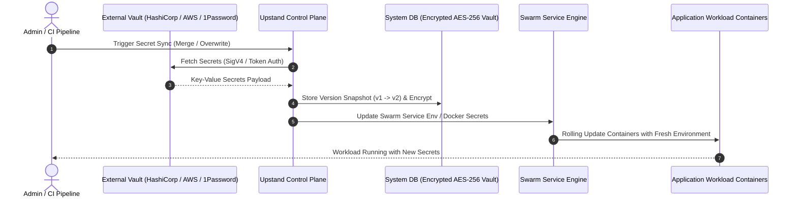

## Versioned secrets

Upstand keeps secret values separate from ordinary resource configuration and supports versioned secret workflows. A version snapshot (`v1`, `v2`, etc.) is logged automatically whenever secrets are modified, synced, or rotated.

- **Version History & Rollback**: From the **Environment** or **Resource** settings tab, click **Version History** to view all recorded snapshots, their creation source (`local`, `Vault`, `AWS`, `Rotation`), and timestamps. Clicking **Restore** reverts the scope's variables to that snapshot and automatically enqueues a workload re-deployment.
- **Security & Access Control**: Secret-management routes require the active organization, relevant RBAC capabilities (`resource:view`, `resource:update`, `environment:update`), and step-up verification when 2FA is enabled. Raw secret values are redacted in browser lists and are never sent to UpGal configuration models.

---

## Secret Management Architecture & Provider Sync



---

## External Secret Providers

Upstand integrates with enterprise secret engines (**HashiCorp Vault**, **AWS Secrets Manager**, and **1Password Connect**) to streamline secret distribution and avoid hardcoding environment variables in repository code.

### Managing Secret Providers

Navigate to **Integrations → Secret Providers** (`/secret-providers`) to configure organization secret providers:

- **HashiCorp Vault**: Requires `Address` (e.g., `https://vault.example.com:8200`), `KV Secret Path` (e.g., `secret/data/myapp`), and a `Vault Token`. Upstand queries the Vault HTTP API (`GET /v1/<path>`).
- **AWS Secrets Manager**: Requires `Region` (e.g., `us-east-1`), `Access Key ID`, `Secret Access Key`, and `Secret Path/ID`. Upstand signs requests using **AWS SigV4** (`AWS4-HMAC-SHA256`) to execute `GetSecretValue`.
- **1Password Connect**: Requires `Connect Host`, `Connect Token`, `Vault ID`, and `Item ID`. Upstand fetches item fields directly via the 1Password Connect API.

All provider credentials are encrypted at rest using AES-GCM (`encryptSecret`) and redacted when listing providers.

---

## Horizontal Pod & Service Autoscaling

```mermaid
flowchart TD
    subgraph MetricsCollector["Metrics Aggregator"]
        DockerStats["cAdvisor / Docker Stats Collector"]
    end

    subgraph ScalingEngine["Autoscaling Evaluation Loop"]
        Eval["Evaluate CPU / RAM / RPS Thresholds"]
        Limits["Verify Min / Max Replica Boundaries & Cooldown"]
    end

    subgraph SwarmCluster["Swarm Cluster Service"]
        Service["Docker Swarm Service: web-app"]
        Replica1["Container Replica 1"]
        Replica2["Container Replica 2"]
        Replica3["Container Replica 3 (Scaled)"]
    end

    DockerStats --> Eval
    Eval --> Limits
    Limits -->|Scale Up (Step +1)| Service
    Service --> Replica1
    Service --> Replica2
    Service --> Replica3
```

---

## Rotation Schedules

Upstand supports both automated background secret rotation and immediate on-demand key rotation:

- **On-Demand Rotation**: Specify target variable key names (e.g., `DB_PASSWORD`, `API_KEY`) and click **Rotate Now**. Upstand generates cryptographically random values, applies them to the scope, and triggers a redeployment.
- **Automated Schedules**: Create a rotation schedule with target keys, an interval in hours (e.g., `168` for weekly), and a generated value length (min 16, max 128 bytes).
- **Concurrency & Claim Locking**: The background runner claims due rotation jobs using atomic lock timestamps (`rotationClaimedUntil`) to prevent duplicate executions in multi-node environments.
- **Workload Re-deployments**: Each rotation logs a new version snapshot and automatically enqueues deployments so running workloads load the newly generated values.

---

## Health Checks & Rollback Integration

Application and Compose resources can define a health check command with interval, timeout, retry count, and start period. Health checks work with the selected deployment strategy and automatic rollback settings. A health-check failure during a rolling update prevents traffic cutover and automatically initiates an image rollback.
