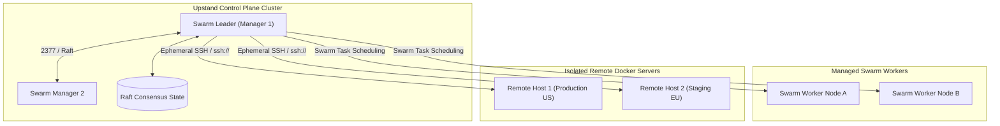
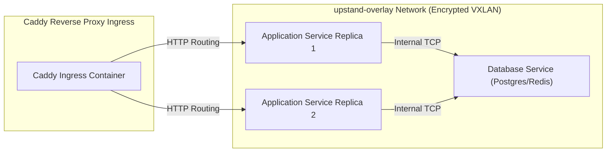

Upstand distinguishes between two deployment topologies: **Remote Servers** (isolated Docker daemons managed over SSH) and **Swarm Nodes** (nodes joined to the central control-plane cluster).

---

## 1. Remote Server & Cluster Topology



---

## 2. Server Network Interaction Architecture



## 2. Remote Server Setup Tutorial

Follow these steps to connect and provision a new remote Docker host:

<Steps>
  <Step>
    ### Generate or import an SSH key pair
    
    Navigate to **Settings → SSH Keys** and create or import a key.
    Copy the **public key** text.
  </Step>

  <Step>
    ### Configure the target server
    
    Log into your remote server and append the public key to the target user's authorized keys:
    
    ```bash
    echo "ssh-ed25519 AAAAC3..." >> ~/.ssh/authorized_keys
    chmod 600 ~/.ssh/authorized_keys
    chmod 700 ~/.ssh
    ```
  </Step>

  <Step>
    ### Add the server in the Upstand Dashboard
    
    1. Go to the **Remote Servers** tab and click **Add Server**.
    2. Input a name, public IP, SSH Port, SSH User, and select your SSH Key.
    3. Click **Setup Server**.
  </Step>

  <Step>
    ### Automated Provisioning
    
    Upstand runs an automated provisioning playbook:
    - Verifies SSH connectivity.
    - Installs the latest stable Docker Engine if missing.
    - Initializes a single-node Swarm manager.
    - Creates the attachable `upstand-network` overlay network.
    - Spawns Caddy to handle routing on the remote server.
  </Step>
</Steps>

---

## 3. Managing the Swarm Cluster

The **Docker Swarm** page manages the physical hosts clustered with the Upstand control plane:

- **Join Tokens**: Reveal and rotate Join Tokens for workers or managers. Rotating a token instantly revokes all prior tokens.
- **Join Command**: Copy the join command and execute it on a worker node:
  ```bash
  docker swarm join --token <JOIN_TOKEN> <MANAGER_IP>:2377
  ```
- **Node Draining**: Before performing server maintenance, update the node status to `drain`. Swarm will immediately reschedule eligible container tasks to other healthy nodes.
- **Safe Node Removal**: Removing a node drains it first and verifies cluster quorum. Upstand protects managers by refusing to remove the Swarm Leader, the local control-plane manager, or the last manager in the cluster.
- **Race Condition Prevention**: Swarm node updates use Docker object version hashing. If node state changes concurrently, the update is safely rejected.
