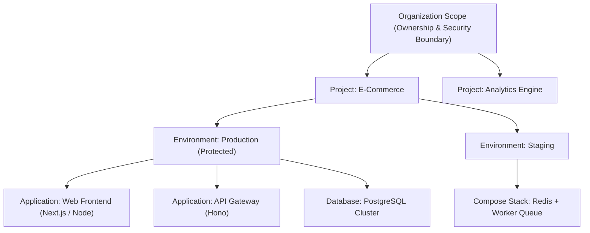
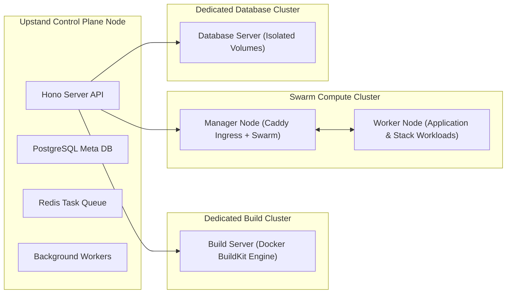

Upstand is an organization-scoped control plane for deploying and operating containerized workloads. The most reliable way to use it is to understand where each piece of configuration lives and how system entities interact.

## The Resource Hierarchy

### Organization
An organization is the top-level authorization and security boundary. All infrastructure servers, projects, environments, resources, domains, SSL certificates, credentials, Git providers, container registries, storage destinations (S3), tags, notification channels, and audit records belong to an active organization. Switching organizations in the dashboard or API updates the scope of all operations.

### Project
A project groups related delivery targets (e.g. `Main Product`, `Customer Portal`). It owns one or more environments. Projects can be created, updated, duplicated, or deleted from **Workloads → Projects**. Deleting a project is a destructive operation that cascades to all environments and resources within it.

### Environment
An environment is a deployable stage within a project, such as `production`, `staging`, or `preview-pr-42`. 
- **Properties**: Slugs, descriptions, protected status flags, parent environment links, and shared environment variables.
- **Inheritance**: Environments can inherit environment variables from a parent environment when inheritance is toggled on, allowing global configuration (like API endpoint URLs) to propagate down.

### Resource
Resources are the containerized workloads Upstand deploys and operates. The control plane manages three core resource types:

| Type | Purpose | Git Build | Custom Domains | Cron Tasks | Backups |
| --- | --- | --- | --- | --- | --- |
| **Application** | Standalone web service or worker container | Yes (Docker / Nixpacks / Compose) | Yes | Yes | N/A |
| **Compose / Stack** | Multi-service Compose definitions | Optional | Yes | Yes | N/A |
| **Database** | Managed database engine (PostgreSQL, MySQL, Redis, MongoDB, MariaDB) | No (Pre-built images) | No | No | Automated S3 / Local |

Every resource exposes runtime state, live metrics, container inspection, deployment history, streaming logs, environment variable secrets, and tag management.

---

## Server Roles & Workload Placement

Upstand separates control plane management from compute workload execution across registered servers:

Servers are registered at organization scope and assigned specialized operational roles:

1. **Deploy Server**: Runs Docker Swarm workloads, Caddy reverse proxy ingress, overlay networking, and health metrics collection.
2. **Build Server**: Offloads heavy Docker image compilations (BuildKit) away from production deployment nodes.
3. **Database Server**: Dedicated compute node isolated for database engines with high I/O persistent disk volume mounts. Cannot host application or Compose stack resources.

---

## Step-by-Step Production Setup Workflow

Follow this step-by-step workflow to structure a production environment:

1. **Create Organization**: Navigate to **Organization Settings** and verify your active organization.
2. **Connect Infrastructure**: Navigate to **Servers → Add Server**. Generate an SSH key pair or attach an existing SSH credential, enter the server IP, and assign the `Deploy` role.
3. **Configure Integrations**: Attach Git providers (GitHub, GitLab, Bitbucket, Gitea) and container registries under **Organization → Integrations**.
4. **Build Project & Environment Hierarchy**:
   - Go to **Workloads → Projects → Create Project**.
   - Add environments (`production`, `staging`). Mark `production` as **Protected** to require explicit confirmation for destructive actions.
5. **Deploy Resources**:
   - Add an **Application** resource, select the Git repository, branch, and build method.
   - Configure Environment Variables (using `${{env.VAR}}` references or direct keys).
   - Assign custom domains, configure health checks, and click **Deploy**.
6. **Verify Runtime**: Monitor deployment logs, inspect live container metrics, and configure backup schedules for databases.
