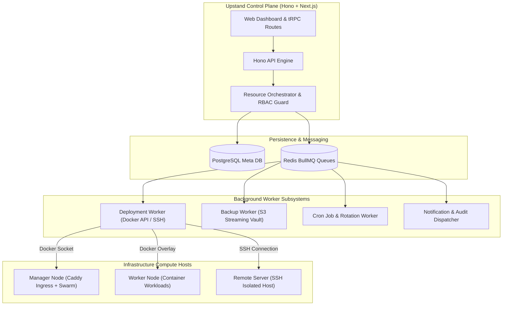

Upstand provides operational management for compute hosts, Docker Swarm clusters, Caddy reverse proxy ingress, and background monitoring workers.

---

## Subsystem Control-Plane Architecture

---

## Remote Server Lifecycle

Use **Infrastructure → Remote Servers** to add a host with a name, SSH address/port, username, and organization SSH key. Choose a role before provisioning:

- **Deploy**: Swarm, Caddy ingress, and monitoring.
- **Build**: Docker build capacity and monitoring.
- **Database**: Swarm database capacity and monitoring.

The wizard saves connection details, runs setup, and reports status. Removing a server registration does not delete workloads already present on the host; it removes the server from Upstand's organization inventory.

## Swarm operations

**Docker Swarm** shows cluster information and nodes. Authorized operators can initialize the cluster, retrieve join commands, update node availability/role, drain and remove nodes, and rotate join tokens. Draining a node changes scheduling and should be coordinated with capacity and replica requirements.

## Docker inventory

**Docker Inventory** provides read and operational views for containers, images, volumes, networks, and Swarm services. Inspect raw Docker responses and bounded logs when needed. Stop/remove controls are destructive and should be used only after confirming the selected server and object.

## Web Server and Caddy

The Web Server page manages Caddy settings, environment values, snippets, previews, logs, health checks, backup settings, Docker cleanup, and GPU detection/configuration. Upstand validates generated Caddy configuration before applying a reload so invalid routing does not replace the active configuration.

Daily Docker cleanup is configurable from the Web Server page. Cleanup affects unused host Docker state; do not enable it until you understand which images, volumes, containers, and build cache are considered unused by the operation.

## Monitoring agent

Monitoring is installed according to server role. The dashboard can read current Docker/server state and bounded historical CPU, memory, disk, network, load, and application/container metrics when available. A monitoring failure should be investigated separately from a workload failure: the absence of a metric does not prove the workload is down.

## Control-plane maintenance

The server runtime includes database migrations, scheduled jobs, outbox publishing, notification delivery, backups, deployment workers, autoscaling, and optional auto-update runtime. Keep PostgreSQL, Redis, and Docker volumes intact during diagnosis. Use the release update flow for upgrades and the audit/observation pages to verify completion.
