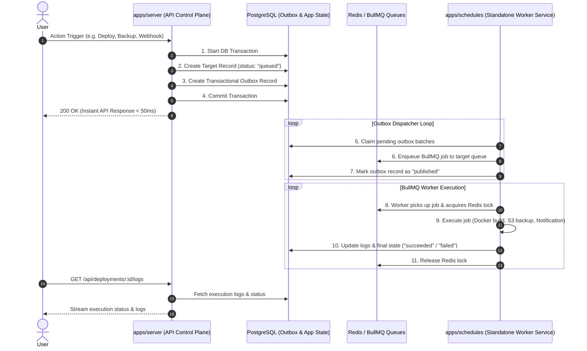

Upstand uses a **standalone, lightweight scheduler service** (`apps/schedules`) to handle all background cron jobs, task scheduling, BullMQ queue workers, and execution runtimes. This isolates heavy worker processing (such as Docker compilation, backup transfers, and notifications) from the primary API control plane (`apps/server`).

---

## 1. System Architecture & Flow

---

## 2. Worker Subsystems & Schedulers

The `apps/schedules` service hosts all background tasks in a single dedicated process:

| Subsystem | Type | Description |
| :--- | :--- | :--- |
| `BackupScheduler` | Cron Scheduler | Periodically evaluates backup schedules and enqueues backup runs. |
| `GeneralScheduler` | Cron Scheduler | Processes custom user-defined cron commands and HTTP endpoints. |
| `AccessLogCleanupScheduler` | Cron Scheduler | Cleans up Caddy access logs based on system policy. |
| `ScheduledDockerCleanup` | Cron Scheduler | Executes daily local and remote Docker resource pruning. |
| `AutoscalingRuntime` | Interval Loop | Reconciles container replica scaling based on performance metrics. |
| `DeploymentRuntime` | BullMQ Worker Pool | Discovers server nodes and consumes deployment build jobs per server queue (`upstand:deployment:queue:<serverId>`). |
| `BackupRunWorker` | BullMQ Worker | Consumes database and application backup execution tasks (`upstand-backup-run`). |
| `NotificationDeliveryWorker` | BullMQ Worker | Delivers system notifications across configured channels (`upstand-notification-delivery`). |
| `OutboxRuntime` | Batch Dispatcher | Dispatches transactional outbox database events to BullMQ queues. |

---

## 3. BullMQ Job ID Rules & Conventions

Upstand follows official [BullMQ Job ID Guidelines](https://docs.bullmq.io/guide/jobs/job-ids) to guarantee reliable job deduplication, Redis key compatibility, and error-free queue processing.

### Key Rules & Best Practices

1. **Queue-Scoped Uniqueness**:
   - Job ID uniqueness is strictly **scoped by queue**. The same job ID can exist in different queues without collision.
   - Auto-generated job ID counters are also scoped per queue.

2. **Deduplication & Job Removal**:
   - Jobs removed from the queue (manually or via `removeOnComplete` / `removeOnFailed`) are not considered duplicates.
   - Once a job is removed, a new job with the same job ID can be enqueued immediately.

3. **Forbidden Separators (`:`)**:
   - Custom job IDs **must not contain `:` (colon)** because BullMQ uses `:` to translate Redis key namespaces.
   - Use hyphen (`-`) or underscore (`_`) instead (e.g., `deployment-dep-84917`, `backup_run_92812`).

4. **Numeric String Restriction**:
   - Custom job IDs **must not be stringified integers** (e.g. `"123"`). Strings containing only digits collide with BullMQ's internal auto-increment format and throw an `Error: Custom Id cannot be integers`.
   - Always prefix numeric business identifiers with a non-digit character (e.g., `job-123`, `dep-456`, `#789`).

---

## 4. Health & Observability API

The `apps/schedules` service exposes a lightweight Hono HTTP server (default port `3002`) for cluster orchestrator health probes and monitoring:

- `GET /health/live`: Liveness check (returns HTTP 200 `{ status: "ok" }`).
- `GET /health/ready`: Readiness check (verifies all worker connections are active).
- `GET /status`: Detailed metrics including process uptime and live BullMQ queue status.
