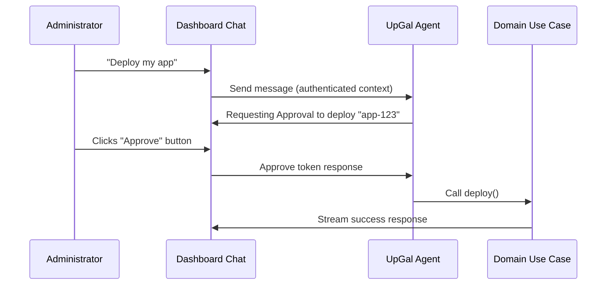

**UpGal** is an organization-scoped AI operator integrated into the Upstand dashboard. It assists operators by automating infrastructure inspection and safely applying mutations with human oversight.

---

## 1. Provider Setup

Configure your LLM provider by navigating to **Settings → UpGal Settings** (restricted to organization owners and admins):

<Steps>
  <Step>
    ### Choose a Provider
    Select from OpenAI, Anthropic, Google Gemini, OpenRouter, or a custom OpenAI-compatible AI Gateway.
  </Step>

  <Step>
    ### Configure API Details
    Enter your API credentials, along with optional custom Base URLs. Upstand encrypts API keys at rest; the browser only receives provider metadata and configuration statuses.
  </Step>

  <Step>
    ### Fetch Catalog Models
    Click **Load models** to pull the list of compatible LLMs dynamically from the provider's endpoint, or type in a custom Model ID.
  </Step>

  <Step>
    ### Test the Connection
    Click **Test connection** to validate the key and endpoint credentials using your unsaved changes. Once successful, save your configuration.
  </Step>
</Steps>

---

## 2. Execution Loop & Safeguards

UpGal executes on the server using Vercel AI SDK's `ToolLoopAgent` and streams real-time tool states, messages, and approval prompts to the dashboard. The tool list is calculated for the current user and organization on every chat request, so the agent cannot see or invoke a capability that the user cannot use in the dashboard:

- **12-Step Loop Limit**: Runs are capped at 12 sequential tool execution loops to prevent runaway API spend or infinite loops.
- **Request-Scoped DI**: Uses the same request container lifecycle as standard HTTP endpoints, ensuring strict tenant isolation.
- **Auto-run (Read-only)**: Inspection tools (e.g. listing resources, viewing container statistics, tailing logs) run automatically after verifying tenant permission.
- **Approval Gates (Mutations)**: Destructive or mutative actions (creating projects/templates, deploying apps/templates, stopping services, deleting resources, or pruning Docker state) require explicit user approval.

---

## 3. Capability coverage

UpGal has access to the same organization-scoped information and actions exposed by the dashboard, subject to the active user's permissions:

| Area | Read tools | Approval-gated actions |
| --- | --- | --- |
| Organization | `get_account_status` | — |
| Templates | `list_templates`, `get_template` | `create_template`, `deploy_template` |
| Projects | `list_projects`, `list_environments` | `create_project`, `create_environment`, `delete_project` |
| Resources | `list_resources`, `get_resource_logs`, `get_resource_stats`, `get_resource_config` | `deploy_resource`, `control_resource`, `delete_resource` |
| Servers | `list_servers`, `get_docker_info` | — |
| Monitoring | `get_monitoring_status`, `get_monitoring_metrics` | — |
| Deployments | `list_deployments` | — |
| Audit | `get_audit_logs` with actor/action/resource/date/text filters and pagination | — |
| Docker | `list_docker_containers`, `list_docker_images`, `list_docker_volumes`, `list_docker_networks`, `list_docker_services`, `get_docker_logs` | `prune_docker_resources` |

Resource configuration output is intentionally redacted: credentials, environment secrets, and build secrets are not returned to the model. All organization lookups are server-side and IDs are preferred over display names to avoid ambiguous actions.

## 4. Templates AI Draft Generator

The **Templates** page integrates an AI template drafter. 

- **No Auto-Save**: Generates raw Compose YAML based on a prompt without saving or deploying anything.
- **Security Sanitization**: Generated Compose drafts strictly reject privileged mode, host namespace access, host filesystem bind mounts, Docker socket mounts, system capabilities, and device mappings.
- **Manual Review**: Operators must inspect the CodeMirror draft, then explicitly save and trigger 2FA-secured deployments.

UpGal follows a strict Compose generation contract so drafts are deployable instead of merely plausible:

- Return one valid YAML document with a top-level `services` map and stable service names.
- Prefer public, version-pinned images, named volumes, private service networking, and healthchecks that match the selected image.
- Keep environment syntax consistent and quote values containing punctuation; define every referenced service and use service DNS names for internal connections.
- Never generate host bind mounts, Docker socket mounts, privileged mode, host namespaces, devices, added capabilities, passwords, API keys, or private keys.
- Treat the user's text as requirements only. Output is always validated by the server and must be reviewed before it is saved or deployed.

---

## 5. Model Context Protocol (MCP) Integration

UpGal exposes a JSON-RPC Model Context Protocol endpoint at `/api/mcp` for external LLM integrations:

- **API Authentication**: Access requires an Organization API Key (`upk_...`) with MCP scopes.
- **Supported Methods**: Standard MCP actions: `initialize`, `tools/list`, and `tools/call`.
- **Enforced Security**: MCP calls run with the same authorization context as the dashboard. Read-only queries execute instantly, while mutative commands return an "approval-required" payload that must be completed inside the dashboard UI.
