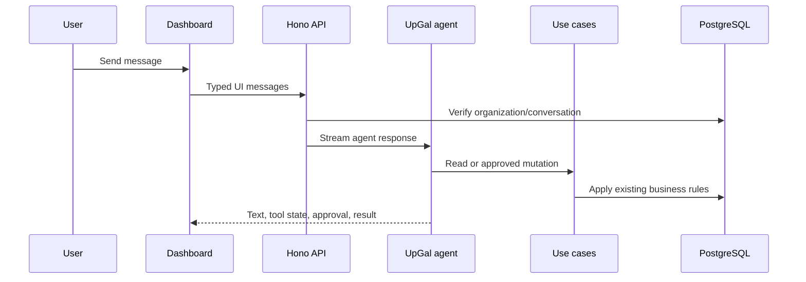

UpGal is the organization-scoped operations assistant built into the Upstand dashboard. It can inspect infrastructure and, with explicit approval, perform supported mutations such as creating projects, deploying resources, or controlling services.

## Architecture

The dashboard chat uses the Vercel AI SDK UI message protocol and AI Elements for rendering conversations, streaming states, tool calls, errors, and approval controls. The server runs a `ToolLoopAgent` with a typed tool set. Each tool delegates to an existing Upstand use case, so dashboard actions and assistant actions share the same authorization and business rules.

## Configure a provider

Organization owners and administrators configure UpGal from **Settings → UpGal Settings**.

1. Choose OpenAI, Anthropic, Google, OpenRouter, or the OpenAI-compatible AI Gateway.
2. Click **Load models** to fetch the current catalog for the selected provider, then choose a model or enter any custom model ID. Catalog requests use the provider's native models endpoint; custom base URLs are supported for compatible gateways.
3. Enter the API key and, when required, a custom base URL.
4. Save the settings and use **Test connection** to verify the configuration. The test uses the values currently in the form, so you can validate a new key before saving it.

The API key is encrypted before persistence. The browser only receives provider, model, base URL, enabled state, and a boolean indicating whether a key is configured. The plaintext key is never returned by the API.

The server also requires the normal Upstand database, Redis, authentication, and encryption-key configuration. The encryption key must be backed up with the rest of the installation secrets; losing it prevents decryption of stored provider credentials.

## Tool behavior and approvals

Read-only tools can run automatically after UpGal verifies that every referenced project, environment, and resource belongs to the active organization. Current read tools include listing projects, environments, resources, servers, and deployments, reading resource logs, and reading resource runtime statistics.

Mutation tools always request approval in the chat UI. The tool is not executed when the user rejects the request, and UpGal must not claim success until the approved tool returns successfully. Current mutation tools include project/environment creation, deployment, resource control, and project/resource deletion.

Approval is enforced at the AI SDK tool boundary. The external MCP surface does not bypass this rule: read-only tools can be exposed through a scoped key, while mutating MCP calls return an approval-required response and must be completed from the dashboard.

## Conversations and runs

Conversations belong to one organization and one authenticated user. Incoming UI messages are validated against the typed `UpGalUIMessage` tool contract before they are stored or passed to the agent. Runs record the model, step count, status, and completion time for operational visibility.

The agent is bounded to twelve loop steps per request. It uses the same request-scoped dependency container as the rest of the API, which keeps repository and use-case lifetimes consistent and makes organization isolation explicit.

## MCP access

UpGal exposes a reusable JSON-RPC MCP endpoint at `/api/mcp`. Create an external key from **Settings → API Keys**, choose only the tool scopes required by the integration, and keep the returned secret in a password manager. The secret is shown once; the database stores only its SHA-256 hash.

Use `*` for all tools or individual scopes such as `tool:list_projects`. Keys can expire and can be revoked without changing other organization settings. Every request is checked for expiry, revocation, scope, and organization ownership.

MCP currently supports `initialize`, `tools/list`, and `tools/call`. Treat tool results as untrusted operational data and keep the endpoint behind HTTPS. Do not put an external key in browser code, source control, URLs, or logs.

## Extension guide

To add a new UpGal capability:

1. Add or reuse a domain use case with its existing typed input and output.
2. Add a Zod input schema and a typed entry in `packages/api/src/ai/upgal.ts`.
3. Classify it as read-only or approval-required in the tool metadata.
4. Add organization/resource ownership checks before executing it.
5. Add the tool to the UI message type and render its states in the AI Elements tool component.
6. Decide whether it is safe to expose through MCP and update the scope documentation.
7. Add focused tests for validation, authorization, approval denial, successful execution, and MCP scope enforcement.

Keep provider access, persistence, and business operations separate. The runtime depends on the typed AI repository contract and existing use cases; it should not import Drizzle tables or duplicate domain rules.

## Limitations and operational guidance

UpGal does not silently execute destructive work, and it does not currently provide a live human-support handoff channel. For support or incidents, stop the run, inspect the relevant logs and deployment status, and use the normal Upstand support/operations process. Streaming failures should be retried only after checking whether a mutation was already accepted.

For production, use a dedicated provider key with the smallest practical quota, restrict MCP scopes, enable 2FA for administrators, rotate keys periodically, and monitor AI run and application logs for unexpected tool activity.
